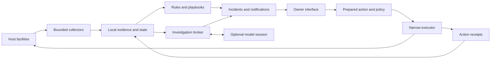

# Descartes from its purpose

## Scope and independence

This is my proposed design, written and saved before reading the current design documents, handoff, manifests, or implementation. My inputs were the supplied AGENTS.md and the introductory purpose statement in README.md. Those inputs already contain architectural preferences, including Rust, local evidence, deterministic rules, and explicit authority. I cannot claim independence from those stated constraints. I have treated them as requirements, rather than assuming that the current implementation is the right way to satisfy them.

The README introduction also describes the present triage interface. That is part of the material I saw; it is not the organizing principle of this proposal. I have not tried to infer the existing code from it. This document stays fixed during the subsequent implementation review so the comparison has an honest baseline.

## 1. The product I would build

Descartes should help the owner of a machine answer five questions:

1. Is the machine doing the jobs I depend on?
2. What changed, and does it need my attention?
3. What do we know about the cause, and what remains uncertain?
4. What is the smallest justified intervention?
5. Did the intervention actually help, and what should we remember?

Its primary object should be a **protected workload**, not an individual metric, command, or conversation. A workload might be a database and its backups, a personal development environment, a home automation service, or a machine's ability to remain reachable. Host resources are dependencies of those jobs.

The first useful version would protect a few explicitly named jobs on one Linux machine. It would watch continuously, retain enough local history to recognize change, produce a small number of trustworthy incidents, and support investigation on demand. It would work usefully with no model configured. Model assistance would improve unfamiliar investigations, not determine whether an expired certificate or failed backup gets noticed.

I would optimize first for an owner who cannot watch the machine all day. Interactive system administration would use the same evidence and incident records, rather than become a separate product with a separate account of reality.

Success is not the number of tools or diagnoses. It is earlier detection of actual trouble, fewer unnecessary interruptions, faster evidence-based decisions, and a trustworthy account of outcomes.

## 2. What using it would feel like

### Installation and first contact

Installation starts an unprivileged local observer. Its first report says what it can inspect, what requires additional access, and what it cannot establish. Installation does not imply permission to upload observations, read arbitrary personal files, or make system changes.

Descartes inventories possible workloads and asks the owner to choose what matters. A development laptop and a database server need different judgments about restarts, resource pressure, uptime, and maintenance windows. Discovery can suggest a service; it cannot establish its business importance.

The owner gives a short protection contract for each selected job:

- Its identity and dependencies: which service, filesystem, endpoint, or scheduled job.
- A useful success condition: responding locally, completing backups, finishing a scheduled run.
- Tolerance: acceptable delay, maintenance periods, and the cost of interruption.
- Notification destination and urgency preferences.
- Observation permissions, model data permissions, and action permissions, separately.

Good defaults should cover simple installations. This need not become a mandatory configuration questionnaire. For an unconfigured host, Descartes can report a limited set of host facts while clearly saying that workload health is not established.

The first run establishes a baseline and records known limitations. It never says everything is healthy merely because no installed check fired.

### An ordinary day

The observer runs cheap checks at bounded intervals. It refreshes slow-changing inventory less often and schedules expensive checks separately. A quiet day produces a concise digest, or no message if the owner prefers. A status view shows protected jobs, open incidents, missing visibility, and the observer's own health.

The owner should be able to ask, “What changed since yesterday?” or “Why is the database marked degraded?” and receive answers tied to the same records that drove notifications.

### An incident

A notification describes impact, evidence, and the next decision:

> The backup job has missed its last two expected successful runs. The database is responding. The most recent backup error reports insufficient space on the backup volume. I have not established whether the previous backup is restorable. View the evidence or investigate the volume.

Every incident has a stable identity. Repeated observations update it. They do not generate an endless stream of new alerts. Acknowledging a notification is different from resolving the condition. Temporary improvement is different from verified recovery.

The owner can inspect the timeline, ask for an investigation, approve a specific prepared action, or record an explanation such as planned maintenance. A model outage does not erase the incident or prevent access to its evidence.

## 3. How it would notice trouble

### Collect facts with explicit limits

Collectors return typed observations with source, target identity, observation interval, collection time, freshness, completeness, and provenance. Each collection also records whether access was denied, parsing failed, a deadline expired, or the platform lacks the facility.

I would keep four concepts separate:

| Concept | Example |
|---|---|
| Collection outcome | Read succeeded, permission denied, timed out |
| Observed fact | Available bytes, unit state, last successful backup |
| Assessment | Healthy, degraded, failing, undetermined |
| Urgency | Informational, owner attention, immediate interruption |

A command succeeding does not mean the workload is healthy. A failed collector does not establish workload failure. A precise measurement does not justify a precise causal diagnosis.

The system must identify the subject of an observation precisely enough for its use. A process ID alone is insufficient for a later action; a process start identity and boot identity help distinguish replacement processes. Resource names can also be reused. Evidence used for an action must be checked again at execution.

Use monotonic time for elapsed intervals and deadlines, wall time for human timelines, and boot or session identity to interpret restarts. Record clock uncertainty when comparing observations across discontinuities. Preserve unknown and partial results through every downstream representation.

### Remember enough to recognize change

A bounded local store holds recent observations, workload inventory, incidents, investigation records, and action receipts. Retention differs by data class: compact state transitions can live longer than sensitive log excerpts. Large captures expire and have explicit byte budgets.

Collection schedules have jitter, deadlines, concurrency limits, and per-domain resource budgets. When resources are scarce, the observer drops optional expensive work first and reports reduced coverage. It should not worsen an out-of-space or overloaded-host incident through unbounded logging or repeated diagnostics.

### Start with useful deterministic judgments

The first rules would detect conditions with clear local evidence and obvious operational value: sustained filesystem pressure, repeated service failure, missed scheduled work, unavailable protected endpoints, and certificate expiry where configured.

Rules use duration, hysteresis, and maintenance context. A momentary CPU spike usually deserves history, not a page. A missing successful backup is judged against that job's expected schedule, not a universal host threshold.

Each rule yields an assessment with the observations that justified it, the protected job affected, and what would count as recovery. These are versioned judgments, so a later explanation can say which rule was applied.

Statistical baselines come later, for cases where a stable threshold does not describe the problem. They need a learning period, explicit confidence limits, handling for workload changes, and evidence of better results than simple rules. “Unusual” is a reason to investigate, not an assertion of failure.

## 4. How it would diagnose

### Investigate a question with a stopping condition

An investigation starts with a question, an incident or workload, and a bounded budget. It asks for the smallest additional observations that distinguish plausible causes. Existing fresh evidence is reused; a full-host sweep is not the default answer to every question.

Known cases use small playbooks. For example, a failed backup first needs the job result, destination availability and capacity, and the recent success history. It does not initially need the entire process table or every system log.

A playbook states applicability, required observations, branches, stop conditions, and possible next decisions. It remains useful without an LLM. Ambiguous or novel cases can escalate to a model with the relevant evidence and the same limits.

### Give the model a constrained working surface

The model may propose a hypothesis, request a permitted observation, connect events, and explain uncertainty. A broker validates every observation request against a registered capability, target scope, cost limit, and data policy. The model does not acquire a general shell or ambient host credentials merely because it is “diagnosing.”

Logs, filenames, service descriptions, and command output are untrusted data. They may contain text that looks like instructions. The broker and action plane enforce authority outside the model, so hostile text cannot grant permissions. Sensitive evidence is minimized before it reaches any external model. Local collection permission does not imply remote disclosure permission.

An investigation result separates:

- Observations: what was measured and when.
- Hypotheses: explanations, supporting and conflicting evidence.
- Unknowns: missing observations that could change the conclusion.
- Next checks: their purpose, cost, and access requirements.
- Recommendations: possible interventions and expected tradeoffs.

Confidence belongs to a specific proposition. I would avoid a single reassuring score attached to an entire report. If numerical probabilities are not calibrated, qualitative uncertainty with explicit missing evidence is more honest.

The engine stops when it has enough evidence for the owner's next decision, exhausts its budget, or needs unavailable access. It records why. Repeatedly asking a model to think harder is not an investigation strategy.

## 5. How it would act

Observation, recommendation, preparation, authorization, and execution are distinct operations. A chat response cannot itself authorize a host change.

### Prepare a reviewable action

An action proposal identifies:

- The incident and evidence motivating it.
- The exact target and typed operation, with parameters.
- Expected effects, disruption, and affected dependencies.
- Preconditions and the period in which the proposal remains valid.
- How success and harm will be checked.
- Recovery or rollback steps, including what cannot be undone.

For example, “restart this service” must disclose likely interruption and check whether restarting could discard useful diagnostic state. “Clean up storage” is too vague to authorize; a prepared proposal must identify the bounded data set and retention rule.

### Authorize exactly that action

The policy engine evaluates the prepared proposal independently of the model. Initially, all host mutations require explicit approval. Approval binds to the proposal's canonical identity, target, parameters, expiry, and relevant preconditions. Broader changes require a new proposal.

Standing authorization comes only after a particular action has evidence of safe behavior, meaningful postchecks, tight scope, and recovery. It needs a limit on frequency and cumulative effect, plus a visible way to revoke it. “Reversible” is a useful property, not a sufficient reason to automate.

### Execute through a small boundary

A separate executor accepts registered typed operations. A privileged helper exists only for operations that actually require privilege and exposes a narrow protocol. It does not interpret model prose, arbitrary scripts, or arbitrary file paths as authority.

At execution time, the executor verifies authorization, target identity, fresh preconditions, and conflicting in-flight work. It records intent durably before starting. If it crashes or loses contact, the action becomes unresolved until reconciliation establishes what happened; blindly retrying may duplicate a change.

Every attempted action produces an audit receipt: proposal, approval source, pre-state, operation, result, post-state, and recovery notes. If the audit facility cannot record a mutation safely, execution stops. Observation can continue with a visible storage fault.

A successful command is not the final outcome. Descartes checks the intended workload condition and watches for regression. Some effects can be reversed, some compensated, and some only contained. The interface must distinguish these.

## 6. How it would learn

An incident closes with an outcome record: confirmed cause if known, intervention if any, recovery evidence, owner corrections, and unresolved uncertainty. Merely accepting an explanation does not make its causal claim true.

Repeated cases can suggest a new rule or playbook. Promotion follows a controlled loop:

1. Capture a scrubbed representative case and counterexamples.
2. Draft a deterministic rule, parser improvement, or playbook change.
3. Replay it against prior cases and test expected non-matches.
4. Run it in shadow mode without sending notifications or taking action.
5. Review the differences, then activate a versioned change.

The model may draft this work. It cannot silently install a new rule or broaden action policy. Operational learning and authority changes are separate review decisions.

I would defer federation until local operation has demonstrated value and there is a concrete knowledge-sharing need. Shareable packages should be reviewed patterns and scrubbed examples with explicit export consent. Hashing a hostname does not automatically make a record anonymous.

## 7. Implementation shape

I would use a modular Rust application with a small number of process boundaries justified by trust. A single unprivileged daemon can own scheduling, local state, rules, incidents, and the local API. Platform collectors sit behind typed interfaces. Model sessions run with constrained resources and access. Privileged operations use the separate executor/helper boundary described above.

The main domain records would be `Workload`, `Observation`, `Assessment`, `Incident`, `Investigation`, `ActionProposal`, `Authorization`, and `ActionReceipt`. Each has a stable identity and explicit lifecycle. These matter more than how many crates exist.

This diagram describes responsibilities, not a requirement for a distributed system. A local transactional database and a local CLI/API are sufficient initially. I would avoid a plugin marketplace, general workflow language, or distributed event fabric until a real workload forces one.

The CLI, any graphical interface, and an external agent client use the same application operations. They can list coverage, inspect evidence, open investigations, prepare actions, and observe action state. Authentication and policy still distinguish clients; interface parity does not mean equal authority.

Portability should follow operational semantics. Each platform adapter reports supported and unsupported capabilities honestly. I would first complete a useful Linux workload loop, then add equivalent macOS behavior where platform facilities allow it. Compiling on a platform is not evidence of operational coverage.

## 8. Descartes must also be observable

The owner needs to know when the observer is blind, late, out of storage, or failing to notify. Descartes tracks collection lateness, retained history, dropped observations, notification delivery, model expenditure, and failed investigations.

A local process cannot guarantee reporting that its own machine has lost power or connectivity. Local-only mode must state that limitation. An optional external heartbeat receiver can cover machine disappearance without receiving raw telemetry; enabling it is a separate network and privacy decision.

Installation, upgrades, removal, and recovery are product features. Schema changes need recovery plans. Partial upgrades must not accidentally broaden authority. Disabling Descartes must revoke standing action capability. An operator should be able to inspect recent incidents and action receipts even when the model provider is unavailable.

## 9. What I would deliver first

| Milestone | Useful owner outcome | Evidence required to call it done |
|---|---|---|
| 1. Observe and remember | See a protected service and its storage history | Bounded collection, honest unknowns, restart-safe state, measured overhead |
| 2. Notice and follow through | Receive one useful incident for sustained failure and a recovery update | Duration/hysteresis tests, deduplication, maintenance behavior, notification retry visibility |
| 3. Investigate | Obtain a grounded explanation and discriminating next checks | Replayable known cases, conflicting evidence, budget exhaustion and unavailable-model behavior |
| 4. Assist safely | Approve one narrow operation and see whether it helped | Stale approval, changed target, crash reconciliation, audit failure, and unsuccessful postcheck tests |
| 5. Improve | Turn one confirmed recurring issue into a cheaper deterministic diagnosis | Counterexamples, shadow results, review and rollback of the rule version |

For the first complete scenario, I would choose a protected service whose scheduled backup starts failing as its destination fills. The exercise crosses observation, notification, diagnosis, recommendation, and recovery verification. The initial remedy can remain manual; proving the operational loop does not require automatic deletion.

I would measure detection delay, missed incidents in replay, false notifications per machine-day, owner-rated usefulness, investigation cost, and resource overhead under normal and degraded host conditions. Action completion would be measured by verified workload recovery, separately from process exit success. Numerical budgets should be chosen for the deployment profile and then measured, rather than asserted without evidence.

The implementation should grow from these completed loops. More collectors, a richer model interface, broader action authority, and federation become justified when they improve a demonstrated operating job.

## 10. Choices and tradeoffs

This approach invests early in time, state, incident handling, and the owner's declared priorities. That delays the impressive demonstration where a model can run dozens of commands. I accept that tradeoff because sustained operational usefulness depends on knowing what changed and whether anyone should care.

It also limits the first release to a small supported environment. A broad inventory tool may attract more initial use, but a narrow set of explicit protection guarantees is easier to evaluate and trust. Unconfigured exploration can remain available without pretending to provide those guarantees.

The decisive design test is an ordinary unattended week: does Descartes notice the right problems, keep its claims within the evidence, use little of the machine it protects, and leave the owner with fewer unresolved operational decisions?
